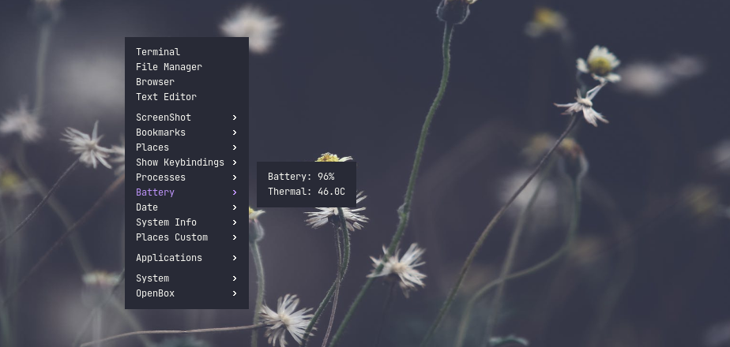
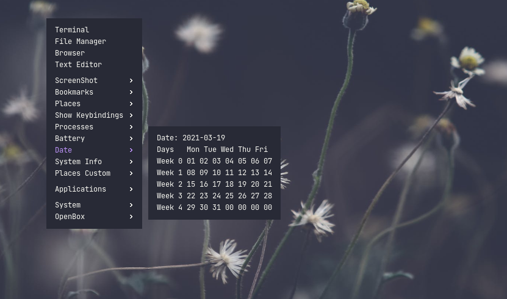
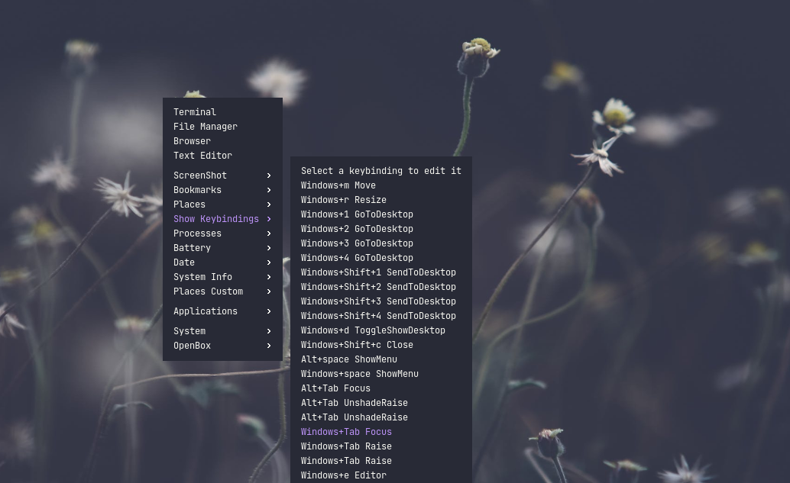
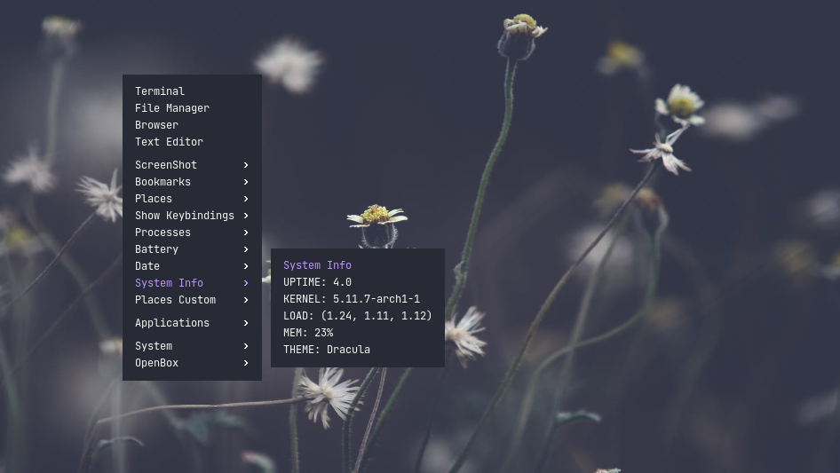
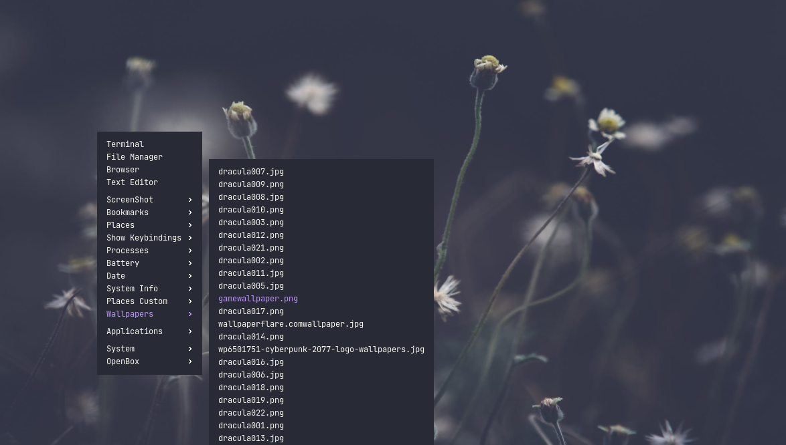
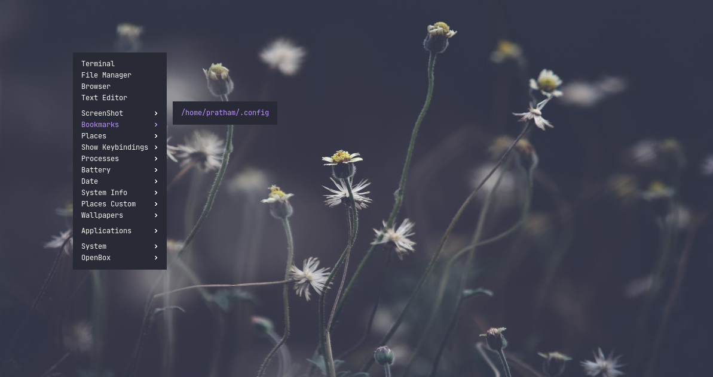
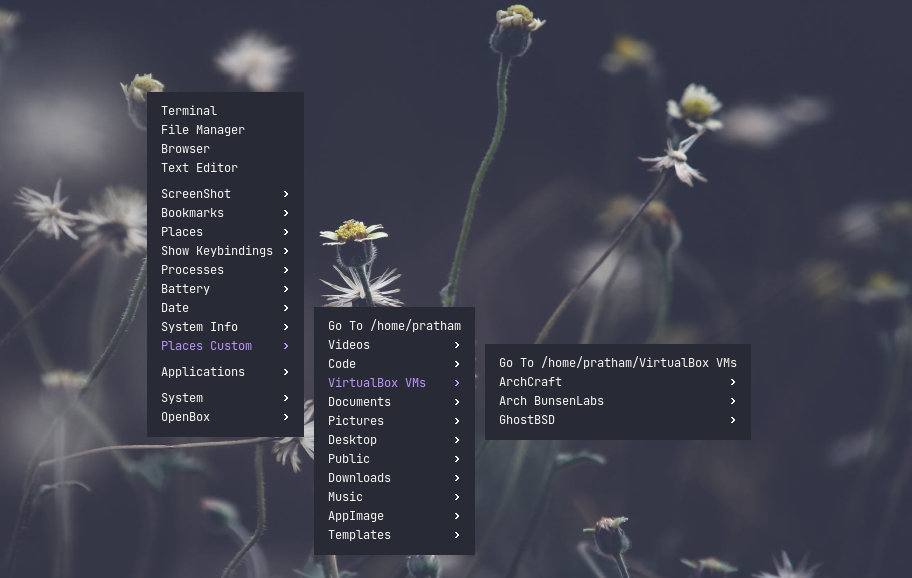

# Openbox-Menu

## What is Openbox?
Openbox is a lightweight floating window manager.Openbox also provides a right-click menu as a app-launcher.
Openbox can also have **pipe-menu** , which are dynamically generated menu,which can be written in any language.

## What is Openbox-Menu?
It is a collection of multiple openbox-menu's which are rewritten for uniformity , along with all the scripts written in Python 3.
Also config file support is added. One config file openbox-menu.xml in ~/.config/openbox/ . Add all the required setting there.

## Installation
Move all the scripts to someplace permanent ,Ex ~/.config/openbox and add them to Openbox Menu using Pipe Menu.If need of graphical software.
Use Kickshaw for adding pipe menu.

## Menus.

| Menu Name | Description | Inspiration/Credit |
| --------- | ----------- | ------------------ |
| battery.py| Shows Thermal and Battery Info | [OpenBox Website](http://openbox.org/wiki/Openbox:Pipemenus:battery) |
| dates.py | Shows Date along with a calender for the month | [Openbox Website](http://openbox.org/wiki/Openbox:Pipemenus:Date_Menu)|
| keybindings.py | Shows all the keybindings for openbox,click to edit | [Joe Bloggs](https://github.com/vapniks/ob-pipe-menus)|
| processes.py | Shows all the processes runnning,can send signals and see ram usage and more | [Vlad George](http://openbox.org/wiki/Openbox:Pipemenus:processes-python)|
| sysinfo.py | Shows all the system info(Ram , Theme,Load etc) | [dbbolton](https://github.com/dbbolton/pipemenus/raw/master/ob-sysinfo.pl)|
| wallpapers.py | Shows all the wallpaper in a directory , click to apply | [Mikde Hokenson](http://www.gozer.org/programs/c/c/ob3_wall.c) and [ArchCraft](https://github.com/archcraft-os/archcraft) |
| gtk-bookmarks.py | Shows all the gtk bookmarks , click to open in file manager | [Mulberry](http://openbox.org/wiki/Openbox:Pipemenus:gtk-bookmarks)|
| places.py| Acts like a file manager allowing you to navigate non-hidden directory | To be updated |

## Photos

## Contributing
Anybody is welcome to contribute to the project.
If you find any bug or want to request any feature , just open a pull request.

